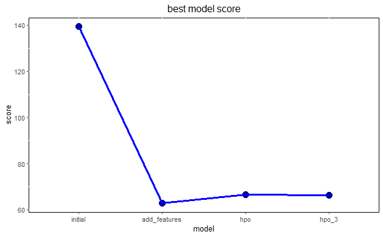
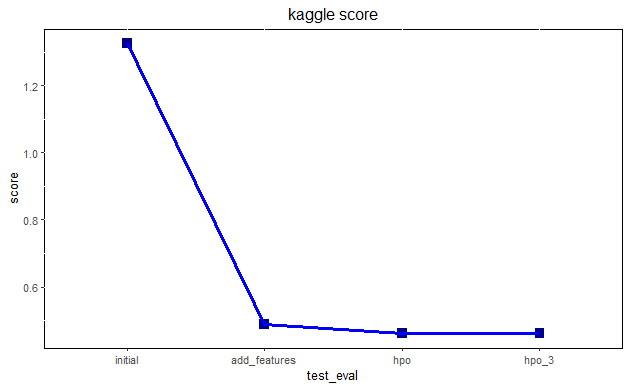
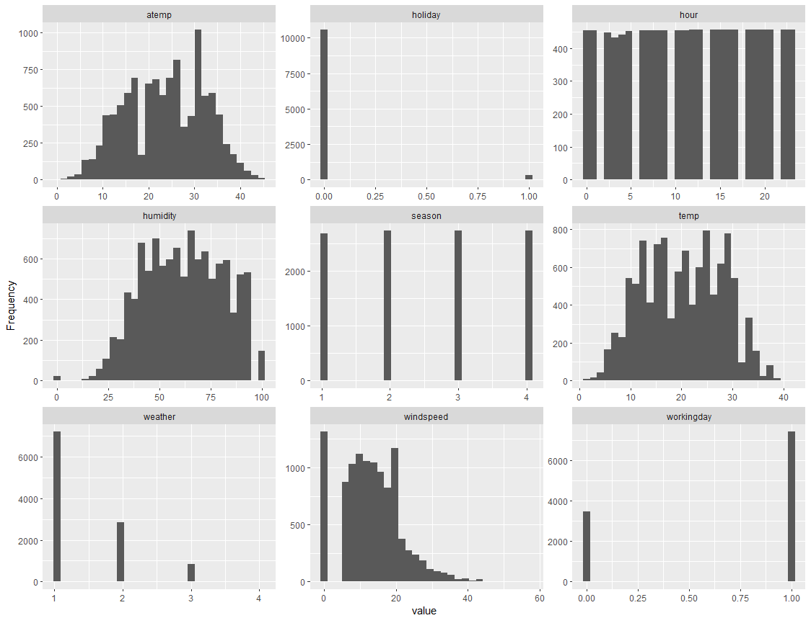
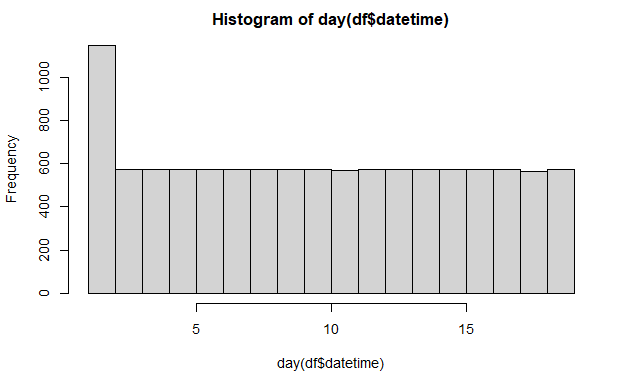
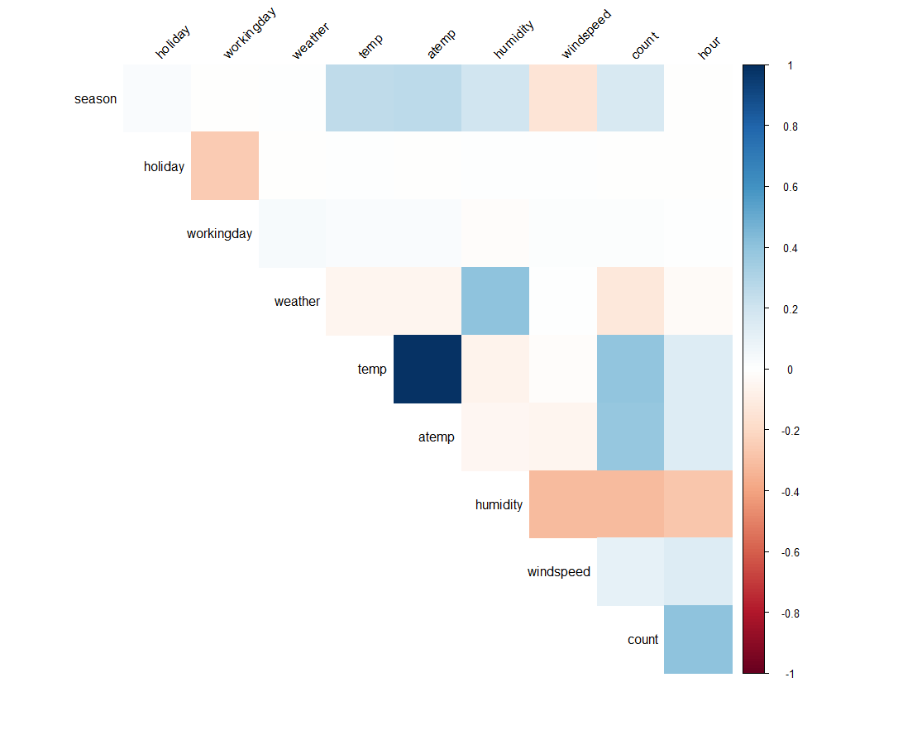
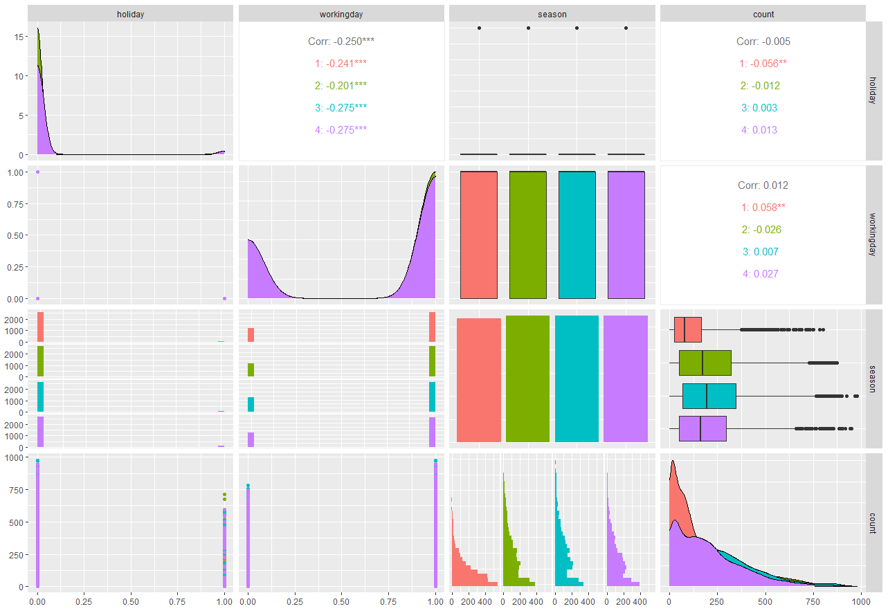

# Report: Predict Bike Sharing Demand with AutoGluon Solution
#### Francisca Ana Soares dos Santos Bronner

## Initial Training
### What did you realize when you tried to submit your predictions? What changes were needed to the output of the predictor to submit your results?
##### The predictions should have positive values otherwise kaggle would regect them. Therefore, any negative value in the predictions should be set to zero before submiting them. I solved the problem with the following lines of code in which I first print the number of negatives values in prediction and set then to 0 if there are any.

    print('number of negative values in predictions:', sum(predictions<0))
    if (sum(predictions<0) > 0):
        predictions[predictions<0]=0
    print('number of negative values in predictions (zero):', sum(predictions<0))

### What was the top ranked model that performed?
##### The top ranked model for all the simulations was the WeightedEnsemble_L3.

## Exploratory data analysis and feature creation
### What did the exploratory analysis find and how did you add additional features?
##### The visualization of the histograms of features shown there were two categorical variables (weather and season) with numerical values which needed to be converted to type categorical. Moreover, since the data was a datatimeindex dataset there was the possibility to create new features by decomposing the datetime in small unities like hour, day, month, and year. Further analysis of datetime shown the presence of gaps of nearly 10 days in datatime sequence starting from 20th till the end of each month (Figure 2: Histogram of day). Moreover, the weather feature contains too few data on the fourth category (Figure 1: Histogram of features).
##### To create a new features from datatime I accessed the index of dataset and extracted the information I needed, then I attributed it to a new column:

    train['hour'] = train.index.hour
    test['hour'] = test.index.hour

### How much better did your model perform after adding additional features and why do you think that is?
##### The model performed a lot better after adding a new feature. That happens because the new feature could explain the variation in the target better, i.e. they were highly correlated (see figure 3: Correlation matrix).

## Hyper parameter tuning
### How much better did your model perform after trying different hyperparameters?
##### Model performance didn't increase much with changing of hyperparameters.

### If you were given more time with this dataset, where do you think you would spend more time?
##### I would create other new features from datatime and also from holidays column (e.g. Easter, Christmas, etc. For instance, the Figure 4 shows that holiday and workingday have some correlation with count depending on the season.). I would either exclude the weather feature because of the lack of data on the fourth category or simply change the value of the fourth category to 3. I would also probably select some models and use grid search to try to find optimal configuration of hyperparameters for these models.

### Create a table with the models you ran, the hyperparameters modified, and the kaggle score.
### <ins>Table 1</ins>
|model|time_limit|num_bag_sets|num_bag_folds|score|
|--|--|--|--|--|
|initial|600|20|10|1.32554|
|add_features|600|20|10|0.48859|
|hpo|600|30|10|0.46097|
|hpo_3|1200|40|10|0.46169|

### Create a line plot showing the top model score for the three (or more) training runs during the project.

### Create a line plot showing the top kaggle score for the three (or more) prediction submissions during the project.

## Summary
#### The simulations used the kaggle "bike sharing demand" dataset (Fanaee-T, H & Gama, J. 2014) to illustrate the use of auto ML to automate and speed model training and evaluation, and how basic techniques of feature engineering can improve performance. The dataset is a datetimeindex dataset with hourly information on bike sharing demand starting from January 1th 2011 until December 19th 2012 with gaps of nearly 10 days in datatime sequence starting from 20th till the end of each month. The dataset contains hourly information about season, several weather variables, workingdays and holidays, basically.
#### <ins>Fitting the data using AutoGluon:</ins>
#### Initialy the data was trained without performing any feature modification neither hyperparameter optimization (initial in Table 1), then, a new feature was added, the time, in hour, at each count of bikes rented (target) and the type of two categorical variables (season and weather) were converted from numerical to categorical so that the model could identify them as categories (add_features in Table 1). Hyperparameter optimization was performed in hpo (Table 1) by increasing the value of 'num_bag_sets' parameter from 20 to 30, and in hpo_3 (Table 1) by decreasing the value of 'num_bag_folds' from 10 to 6, further increasing the value of 'num_bag_sets' to 40, and doubling the 'time_limit'. hpo got the best kaggle score (0.46097). Overal, any other configurations of hyperparameters tried performed worse.

## Citations:
- Bike Sharing Demand: Forecast use of a city bikeshare system. https://www.kaggle.com/c/bike-sharing-demand
- Fanaee-T, H., Gama, J. Event labeling combining ensemble detectors and background knowledge. Prog Artif Intell 2, 113–127 (2014). https://doi.org/10.1007/s13748-013-0040-3

## Figures
#### <ins>Figure 1:</ins> Histogram of features

#### <ins>Figure 2:</ins> Histogram of day

#### <ins>Figure 3:</ins> Correlation matrix

#### <ins>Figure 4:</ins> Correlation of holiday and workingday decomposed by season

